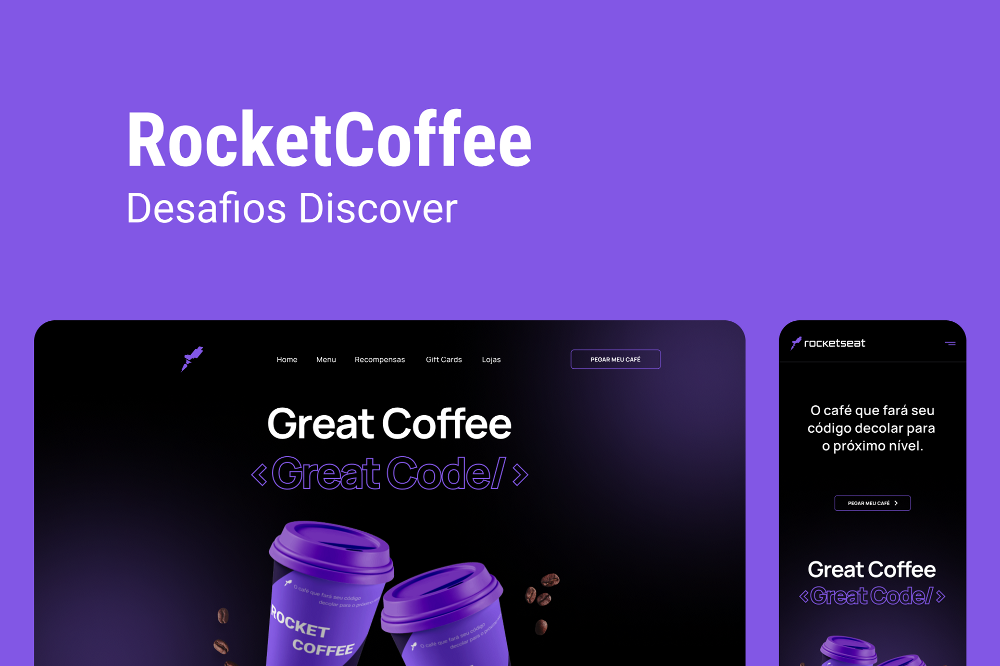

<h1 align="center"> RocketCoffee </h1>
 

  

## 💻 Projeto

Neste desafio você deverá desenvolver uma homepage responsiva para uma marca de café.

## 🚀 Tecnologias

Esse projeto foi desenvolvido com as seguintes tecnologias:

- HTML, CSS e uma Biblioteca de animações
- Javascript
- Git e Github
- Figma
